<p align="center">
  <a href="https://efacamverse.lebert.ai/">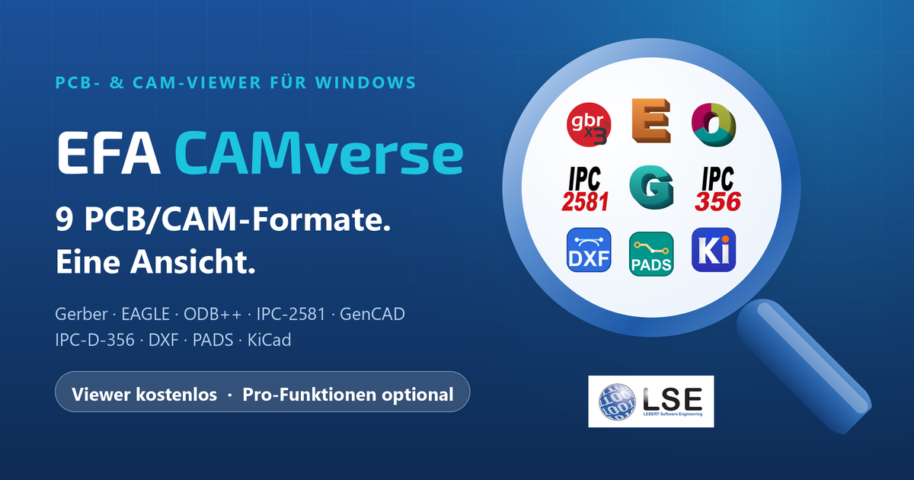</a>
</p>

<p align="center">
  <a href="README.md">English</a> &nbsp;·&nbsp; <b>Deutsch</b>
</p>

<p align="center">
  <a href="https://github.com/__ORG__/EFA-CAMverse/releases/latest"></a>
  <a href="https://github.com/__ORG__/EFA-CAMverse/releases"></a>
  
  
  <a href="https://efacamverse.lebert.ai/"></a>
</p>

#  EFA CAMverse

**9 PCB/CAM-Formate. Eine Ansicht.**
EFA CAMverse öffnet Gerber X3, EAGLE, ODB++, IPC-2581, GenCAD, IPC-D-356, DXF, PADS und KiCad in einem einzigen nativen Windows-Tool – Lagen, Stackup, Bohrungen, Bauteile und Netzlisten auf einen Blick, in 2D und 3D.

<table align="center">
  <tr>
    <td align="center"><h2>9</h2>Formate nativ</td>
    <td align="center"><h2>1</h2>Werkzeug, On-Premise</td>
    <td align="center"><h2>100 %</h2>lokal &amp; sicher</td>
  </tr>
</table>

> **Neu:** Aus Gerber X/X2 + Koordinaten wird Gerber X3 (für die Bestückung) → [mehr dazu](#gerber-x3)

## Download

### [⬇ EFA CAMverse 2026 herunterladen – aktuelles Release](https://github.com/__ORG__/EFA-CAMverse/releases/latest)

| Datei | Zweck |
|---|---|
| [`EFA_CAMverse_2026_Setup_x64.exe`](https://github.com/__ORG__/EFA-CAMverse/releases/latest/download/EFA_CAMverse_2026_Setup_x64.exe) | **Empfohlen.** Setup-Paket inklusive Microsoft-Visual-C++-Laufzeit. Interaktive Installation; eine vorhandene Installation wird an Ort und Stelle aktualisiert. |
| [`EFA_CAMverse_2026_x64.msi`](https://github.com/__ORG__/EFA-CAMverse/releases/latest/download/EFA_CAMverse_2026_x64.msi) | Reines Windows-Installer-Paket für Administratoren und Softwareverteilung. Benötigt das Microsoft Visual C++ 2015–2022 x64 Redistributable. |
| `SHA256SUMS.txt` | SHA-256-Prüfsummen der obigen Dateien (liegt jedem Release bei). |

**Systemvoraussetzungen:** Windows 10 oder Windows 11, 64-bit.

EFA CAMverse ist als Viewer kostenlos nutzbar – höherwertige Funktionen schalten Sie bei Bedarf frei. Nativ unter Windows, Ihre Daten bleiben lokal. Die Anwendung weist gelegentlich auf weitere Produkte der EFA SmartSuite hin und prüft beim Start auf Updates.

### Windows SmartScreen

Da EFA CAMverse gerade erst veröffentlicht wurde, zeigt Windows beim ersten Start noch einen SmartScreen-Sicherheitshinweis („Der Computer wurde durch Windows geschützt“). Das ist normal – die App ist mit einem EV-Zertifikat signiert und sicher. So lässt sie sich starten:

**1 · Weitere Informationen** → **2 · Trotzdem ausführen**

### Download prüfen

Alle Binärdateien sind mit einem Extended-Validation-Code-Signing-Zertifikat signiert, ausgestellt auf **LEBERT Software Engineering GmbH & Co. KG**. Signatur und Prüfsumme lassen sich in PowerShell prüfen; den Hash mit der `SHA256SUMS.txt` des Releases vergleichen:

```powershell
Get-AuthenticodeSignature .\EFA_CAMverse_2026_Setup_x64.exe | Format-List Status, SignerCertificate
Get-FileHash .\EFA_CAMverse_2026_Setup_x64.exe -Algorithm SHA256
```

## Unterstützte Formate

**Ein Viewer für alle PCB/CAM-Formate.** Gerber, ODB++, IPC-2581, KiCad und fünf weitere Formate öffnen und ansehen – von der Konstruktion bis zur Fertigungsprüfung. EFA CAMverse liest jedes Format nativ, ohne Konvertierung und ohne Cloud.

| | Format | |
|:---:|---|---|
| 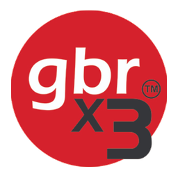 | **Gerber X/X2/X3** | .gbr / .ger – RS-274X & Excellon-Bohrdaten, inkl. .gbrjob |
|  | **EAGLE** | .brd- & .sch-Dateien nativ öffnen – ohne Import |
| 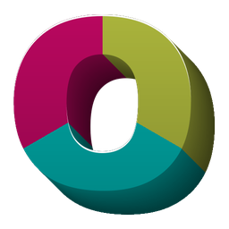 | **ODB++** | Lagen, Netze & Stackup ansehen |
| 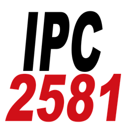 | **IPC-2581** | Offener Industriestandard (DPMX) |
|  | **GenCAD 1.4** <sub>EINZIGARTIG</sub> | Bestückdaten – Import & Export |
|  | **IPC-D-356** <sub>EINZIGARTIG</sub> | Bare-Board-Netzliste & Testdaten |
| 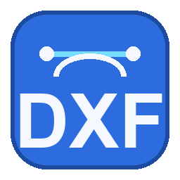 | **DXF** | .dxf – Mechanik & Bestückung (AutoCAD) |
| 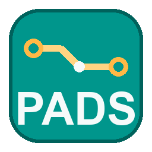 | **PADS Layout** <sub>EINZIGARTIG</sub> | .asc nativ ansehen (Siemens/Mentor) |
|  | **KiCad** | .kicad_pcb & .kicad_pro öffnen |

<a id="gerber-x3"></a>
## Gerber X/X2 + Koordinaten = Gerber X3 (Bestückung)

*Neu: Für EMS-Dienstleister.* Der EMS-Alltag: Der Kunde liefert klassische Gerber-Daten ohne Bauteilinformation – und irgendeine Pick-&-Place-Datei. EFA CAMverse führt beides zusammen und ergänzt die komplette Bauteilebene, wie man sie sonst nur von Gerber X3 kennt.

- **Koordinatendatei laden – fertig:** EFA CAMverse ordnet jedem Bauteil automatisch Pads, Bestückungsdruck-Umriss und Bohrungen zu.
- **Kein Umformatieren nötig:** Spaltenaufbau, Trenn- und Dezimalzeichen, Maßeinheit und Seitenangabe erkennt EFA CAMverse selbst – auch ohne Kopfzeile. Sie laden die Liste, wie Ihr Kunde sie liefert, ob aus Altium, KiCad, EAGLE, …
- **Nachvollziehbar statt Blackbox:** Ein Bericht zeigt nach jedem Lauf, welche Bauteile sicher zugeordnet sind und welche nicht. Sitzt eines falsch, setzen Sie es mit zwei Klicks im Bild an die richtige Stelle.
- **Ab jetzt wie echtes X3:** Bestückungsansichten, Varianten, Stückliste und 3D stehen zur Verfügung, als hätte der Datensatz seine Bauteile immer gekannt. Die geprüften Koordinaten geben Sie als CSV aus – für die Maschinenprogrammierung oder zurück an den Kunden.

<table>
  <tr>
    <td align="center" valign="middle" width="26%">
      <br>
      <b>Gerber X/X2</b> <code>.gbr</code><br>
      <sub>Lagen, Pads, Bohrungen – ohne Bauteilinfo</sub>
    </td>
    <td align="center" valign="middle"><h2>+</h2></td>
    <td align="center" valign="middle" width="30%">
      <b>Koordinaten</b> <code>.csv / .txt</code>
      <pre>RefDes  X       Y      Rot
C12     12.70   45.10   90
R7      33.02   18.50    0
U3      58.42   27.94  270</pre>
      <sub>Pick-&amp;-Place-Datei aus dem CAD</sub>
    </td>
    <td align="center" valign="middle"><h2>=</h2></td>
    <td align="center" valign="middle" width="34%">
      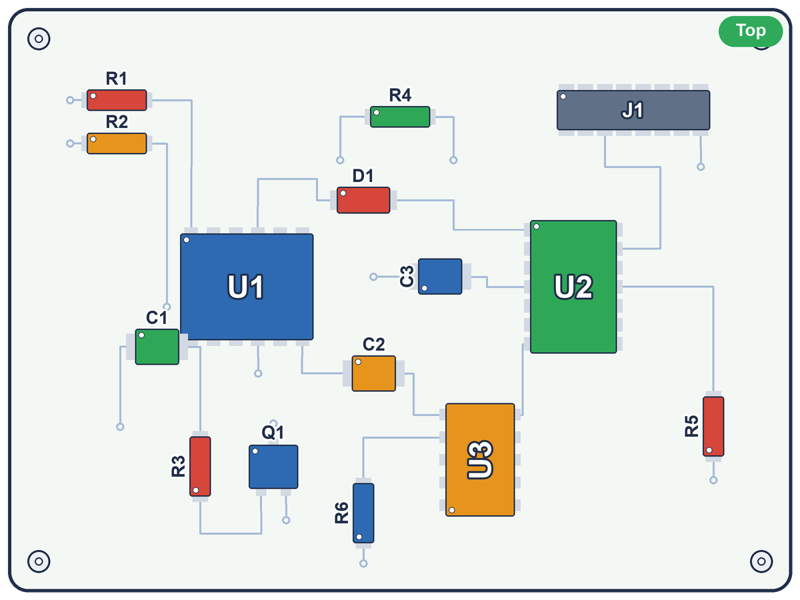<br>
      <b>Gerber X3 (für die Bestückung)</b><br>
      <sub>Bauteile, Referenzen, Bestückungsansichten, BoM – der volle X3-Komfort</sub>
    </td>
  </tr>
</table>

## Funktionen – Sehen. Prüfen. Fertigen.

Ein einheitlicher Funktionssatz über alle Formate – statt für jedes Format ein anderes Werkzeug.

<table>
  <tr>
    <td width="33%" valign="top"><br><b>Lagen &amp; Stackup</b><br>Alle Lagen einzeln schalten, Transparenz regeln und den kompletten Materialaufbau im Stackup-Pane lesen.</td>
    <td width="33%" valign="top">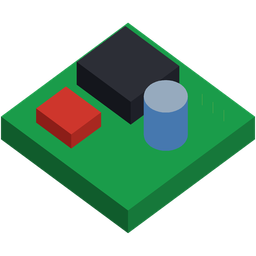<br><b>3D-Ansicht</b><br>Die Leiterkarte räumlich betrachten – mit Bauteilen als 3D-Körper, frei drehen und zoomen.</td>
    <td width="33%" valign="top"><br><b>Bohrungen &amp; Netze</b><br>Bohrtabellen, Netzlisten-Pane und bidirektionales Highlight – per Doppelklick zum Netz zoomen.</td>
  </tr>
  <tr>
    <td valign="top"><br><b>Bestückung &amp; Varianten</b><br>Bestückungsansichten flexibel erstellen – Bauteile passend zur Kundenvariante per Klick ein- und ausblenden, Beschriftung frei wählbar.</td>
    <td valign="top">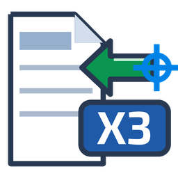<br><b>Gerber X/X2 + Koordinaten = X3</b><br>Klassische Gerber-Daten um externe Koordinatendaten ergänzen – EFA CAMverse führt beides zu Gerber X3 (für die Bestückung) zusammen.</td>
    <td valign="top">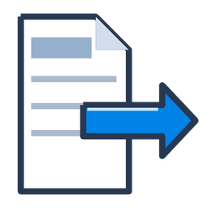<br><b>Export &amp; Fertigen</b><br>Für die Fertigung exportieren: Bilder als PDF, PNG oder JPG, Koordinaten und BoM als CSV.</td>
  </tr>
  <tr>
    <td valign="top"><br><b>Messen &amp; Inspizieren</b><br>Präzise Abstands- und Geometriemessung – mit Hüllrechteck und Mittelpunkt jeder Komponente.</td>
    <td valign="top"><br><b>Formate wandeln &amp; GenCAD</b><br>Eingelesene Daten als GenCAD 1.4 weitergeben – echte Konvertierung, nicht nur Anzeige.</td>
    <td valign="top"><br><b>Offline &amp; nativ</b><br>Native Windows-Anwendung – keine Cloud, kein Upload. Ihre Fertigungsdaten bleiben lokal.</td>
  </tr>
</table>

## Bestückdruck & Varianten

**Bestückdruck selbst erzeugen – so, wie die Fertigung ihn braucht.** EFA CAMverse zeigt keinen gelieferten Bestückplan an, sondern zeichnet ihn aus den Daten selbst – Bauteil für Bauteil. Genau deshalb lässt sich die Variante Ihres Kunden wirklich abbilden: Was nicht bestückt wird, erscheint gar nicht erst.

- **Variantenhandling:** Komponenten per Klick ab- und wieder anwählen – abgewählte Bauteile verschwinden vollständig, mit Gehäuse, Pads und Beschriftung. Aus der gelieferten Vollbestückung wird so die Variante des Kunden, in 2D wie in 3D.
- **Beschriftung, selektiv:** Jedes Bauteil wird automatisch mit seiner Referenz beschriftet – Testpunkte, Passermarken oder ganze Gruppen blenden Sie per Namensmuster aus. Schriftart und Schriftgröße wählen Sie frei.
- **Farben nach Ihrer Vorgabe:** Platinenfläche, Rand, Gehäuse, Pads, Pin-1-Marker und Beschriftung haben je eine eigene Farbe – Pads, Pin-1 und Beschriftung lassen sich auch ganz abschalten.
- **Lage dazublenden:** Jede beliebige Lage – etwa Lötstopp oder Bohrbild – legen Sie farbig und transparent über den Bestückdruck.
- **Beide Seiten:** Ober- und Unterseite als jeweils eigene Bestückungsansicht.
- **Ausgabe:** Bestückplan, Koordinatendaten und Stückliste für die Fertigung exportieren.

<table>
  <tr>
    <th width="50%">Vollbestückung</th>
    <th width="50%">Kundenvariante</th>
  </tr>
  <tr>
    <td></td>
    <td>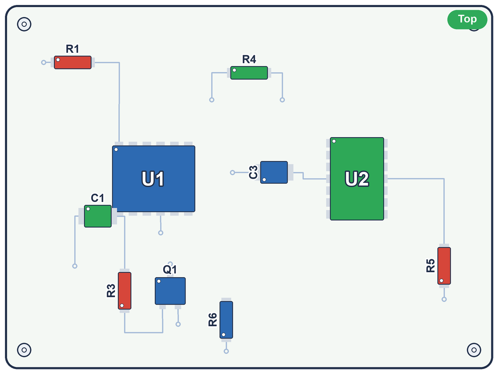</td>
  </tr>
</table>

## 3D-Ansicht

**Die Leiterkarte in 3D – interaktiv und realistisch.** Ein Klick wechselt von der Lagenansicht in die räumliche Darstellung: Leiterkarte, Oberflächen und Bauteile als echtes 3D-Modell – frei dreh- und zoombar.

<p align="center">
  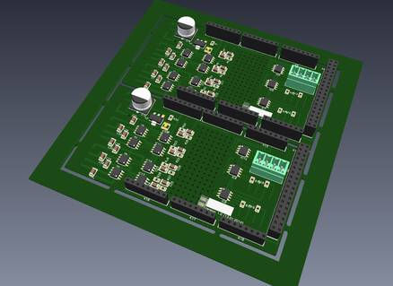
</p>

- **Realistisch extrudierte Leiterkarte:** Substrat, Lötstopplack und Oberflächen wie am fertigen Board.
- **Bauteile als 3D-Körper:** automatisch erzeugt – auf Wunsch mit echten 3D-Modellen aus dem nachladbaren Modellpaket.
- **Modelle zuordnen:** komfortabel per Suche und 3D-Vorschau im Zuordnungs-Dialog.
- **Frei drehen und zoomen:** ausgeblendete Bauteile der Variante verschwinden live auch in 3D.

Das optionale **3D-Modellpaket** (KiCad-3D-Bibliotheksmodelle im VRML-Format, CC-BY-SA 4.0) wird als eigenes [Release](https://github.com/__ORG__/EFA-CAMverse/releases/tag/3dmodels-9.0.0) veröffentlicht; EFA CAMverse lädt und installiert es aus der Anwendung heraus.

## Warum EFA CAMverse

**9 PCB/CAM-Formate. Eine Anwendung. Ein Workflow.** Ein vertrautes Bedienkonzept für jedes Format: einmal einarbeiten, dann Gerber, ODB++, KiCad und sechs weitere Formate gleich bedienen – in einer einzigen Anwendung.

- **Ein Bedienkonzept für alles** – Einmal einarbeiten, dann jedes Format identisch bedienen: Lagen, Stackup, Messen und Export funktionieren überall gleich.
- **Direkt nativ, ohne Umwege** – Jedes Format ohne Zwischenkonvertierung öffnen und sofort arbeiten – kein Export-Import-Hin-und-Her zwischen Programmen.
- **Formate Seite an Seite** – Verschiedene Formate desselben Projekts in einer Oberfläche öffnen und gemeinsam betrachten.
- **Brücke zwischen Formaten** – Aus jedem der 9 PCB/CAM-Formate lesen und als GenCAD 1.4 weitergeben – EFA CAMverse verbindet, was sonst getrennt bleibt.
- **Eine Installation, ein Update** – Eine Anwendung statt vieler Einzeltools pflegen – ein Update, ein Ansprechpartner, alles lokal.

| | Ihr Gewinn mit einem Werkzeug |
|---:|---|
| **9** | Formate in einem Bedienkonzept |
| **1** | Installation statt vieler Werkzeuge |
| **0** | Zwischenkonvertierungen nötig |
| **3D** | die dritte Dimension – Platinen räumlich begutachten |
| **100 %** | offline & lokal – Ihre Daten bleiben bei Ihnen |

## Viewer kostenlos & Pro-Funktionen

EFA CAMverse ist als Viewer kostenlos nutzbar – höherwertige Funktionen schalten Sie bei Bedarf frei.

**Pro-Funktionen:**

1. Erstellen von **Bestückungsansichten** (Ober-/Unterseite) inkl. **konfigurierbarem Bestückungsdruck**
2. **Export**: Koordinaten & BoM als CSV, Netzliste
3. **Konvertierungen** der PCB/CAM-Formate
4. … und vieles mehr

## Über dieses Repository

EFA CAMverse ist proprietäre Closed-Source-Software von LEBERT Software Engineering. Dieses Repository enthält **keinen** Quellcode – es ist die öffentliche Anlaufstelle für

- die **Installationsdateien** → [Releases](https://github.com/__ORG__/EFA-CAMverse/releases),
- das **[Änderungsprotokoll](CHANGELOG.md)**,
- **Fehlermeldungen und Funktionswünsche** → [Issues](https://github.com/__ORG__/EFA-CAMverse/issues).

## Support & Feedback

- Fehler gefunden oder Funktion vermisst? [Issue anlegen](https://github.com/__ORG__/EFA-CAMverse/issues/new/choose) – auf Deutsch oder Englisch.
- Fragen, Lizenzierung, vertrauliche Beispieldaten: [EFA_CAMverse@lse.cc](mailto:EFA_CAMverse@lse.cc)
- Produkt-Website: [efacamverse.lebert.ai](https://efacamverse.lebert.ai/)

## Rechtliches

<a href="https://lebert.org"></a>

EFA CAMverse ist Teil der **EFA SmartSuite** für die Elektronikfertigung – entwickelt von [LEBERT Software Engineering](https://lebert.org).

© 2026 LEBERT Software Engineering GmbH & Co. KG. Alle Rechte vorbehalten. Die Nutzung der Software unterliegt den [Lizenzbedingungen](LICENSE.md). Die Software enthält Open-Source-Komponenten (OpenCV, pugixml, earcut.hpp, libzip, zlib) unter ihren jeweiligen Lizenzen; das optionale 3D-Modellpaket enthält KiCad-Bibliotheksmodelle unter CC-BY-SA 4.0 – siehe [LICENSE.md](LICENSE.md).
Alle Marken sind Eigentum ihrer jeweiligen Inhaber.

[Impressum](https://lebert.org/impressum) · [Datenschutz](https://lebert.org/datenschutzerklaerung)
