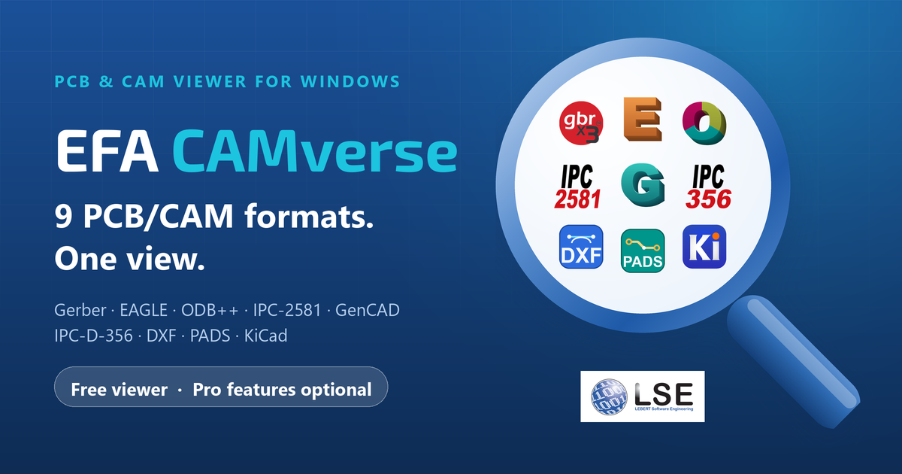
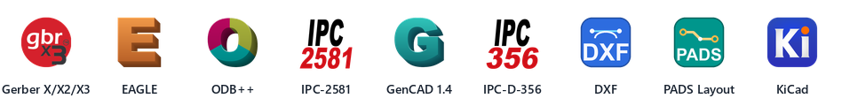
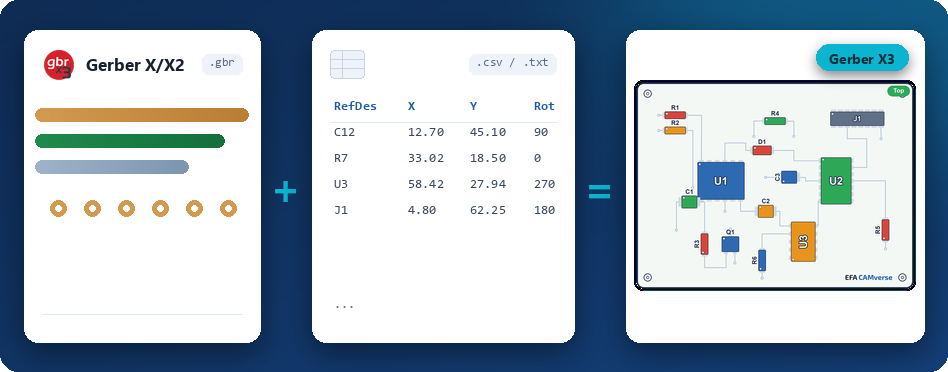

<p align="center">
  <a href="https://efacamverse.lebert.ai/"></a>
</p>

<p align="center">
  <b>English</b> &nbsp;·&nbsp; <a href="README.de.md">Deutsch</a>
</p>

<p align="center">
  <a href="https://github.com/LEBERT-Software-Engineering/EFA-CAMverse/releases/latest"></a>
  <a href="https://github.com/LEBERT-Software-Engineering/EFA-CAMverse/releases"></a>
  
  <a href="https://efacamverse.lebert.ai/"></a>
</p>

#  EFA CAMverse

**9 PCB/CAM formats. One view.** EFA CAMverse opens Gerber X3, EAGLE, ODB++, IPC-2581, GenCAD, IPC-D-356, DXF, PADS and KiCad in a single native Windows tool – layers, stackup, drills, components and netlists at a glance, in 2D and 3D.

<p align="center"><b>9</b> formats, native &nbsp;·&nbsp; <b>1</b> tool, on-premise &nbsp;·&nbsp; <b>100 %</b> local &amp; secure</p>

> **New:** Gerber X/X2 + coordinates become Gerber X3 (for assembly) → [read more](#gerber-x3)

<br>

<h2 align="center">Download</h2>

<p align="center">
  <a href="https://github.com/LEBERT-Software-Engineering/EFA-CAMverse/releases/latest"></a>
  &nbsp;
  <a href="https://efacamverse.lebert.ai/"></a>
</p>

| File | Purpose |
|---|---|
| [`EFA_CAMverse_2026_Setup_x64.exe`](https://github.com/LEBERT-Software-Engineering/EFA-CAMverse/releases/latest/download/EFA_CAMverse_2026_Setup_x64.exe) | **Recommended.** Setup bundle including the Visual C++ runtime; interactive installer, upgrades an existing installation in place. |
| [`EFA_CAMverse_2026_x64.msi`](https://github.com/LEBERT-Software-Engineering/EFA-CAMverse/releases/latest/download/EFA_CAMverse_2026_x64.msi) | Plain Windows Installer package for administrators and software deployment (requires the Visual C++ 2015–2022 x64 Redistributable). |
| `SHA256SUMS.txt` | SHA-256 checksums of the files above, attached to every release. |

Windows 10 or 11, 64-bit. EFA CAMverse is free to use as a viewer – unlock advanced features whenever you need them. Native on Windows, your data stays local. The application occasionally points to other EFA SmartSuite products and checks for updates at startup.

<details>
<summary><b>Windows SmartScreen on first launch</b></summary>
<br>
As EFA CAMverse has only just been released, Windows still shows a SmartScreen security prompt on first launch (“Windows protected your PC”). This is normal – the app is signed with an EV certificate and is safe. To run it: <b>More info</b> → <b>Run anyway</b>.
</details>

<details>
<summary><b>Verifying signature and checksum</b></summary>
<br>
All binaries are signed with an Extended Validation code-signing certificate issued to <b>LEBERT Software Engineering GmbH &amp; Co. KG</b>. In PowerShell:

```powershell
Get-AuthenticodeSignature .\EFA_CAMverse_2026_Setup_x64.exe | Format-List Status, SignerCertificate
Get-FileHash .\EFA_CAMverse_2026_Setup_x64.exe -Algorithm SHA256
```

Compare the hash with `SHA256SUMS.txt` of the release.
</details>

<br>

<h2 align="center">Supported formats</h2>

<p align="center"><b>One viewer for every PCB/CAM format.</b> EFA CAMverse reads each format natively – from design to manufacturing inspection, with no conversion and no cloud.</p>

<p align="center">
  <picture>
    <source media="(prefers-color-scheme: dark)" srcset="assets/formats_strip_dark.png">
    
  </picture>
</p>

<details>
<summary><b>File types and details</b></summary>
<br>

| Format | | |
|---|---|---|
| **Gerber X/X2/X3** | `.gbr` `.ger` `.gtl` `.gbl` … `.pho` · `.drl` · `.gbrjob` | RS-274X & Excellon drill data, incl. Gerber job file |
| **EAGLE** | `.brd` | Open board files natively – no import |
| **ODB++** | `.tgz` `.tar.gz` `.zip` | View layers, nets & stackup |
| **IPC-2581** | `.xml` `.cvg` `.zip` | Open industry standard (DPMX) |
| **GenCAD 1.4** | `.cad` `.gcd` `.pnl` | Assembly data – import & export · *unique* |
| **IPC-D-356** | `.ipc` `.356` `.d356` | Bare-board netlist & test data · *unique* |
| **DXF** | `.dxf` | Mechanical & assembly (AutoCAD) |
| **PADS Layout** | `.asc` | View natively (Siemens/Mentor) · *unique* |
| **KiCad** | `.kicad_pcb` `.kicad_pro` | Open board and project files |

</details>

<br>

<a id="gerber-x3"></a>
<p align="center"><sub><b>NEW · FOR EMS PROVIDERS</b></sub></p>
<h2 align="center">Gerber X/X2 + coordinates = Gerber X3 (for assembly)</h2>

**Everyday EMS reality:** the customer delivers classic Gerber data without component information – plus some pick & place file. EFA CAMverse merges both and adds the complete component layer you otherwise only get from Gerber X3.

<p align="center">
  
</p>

- **Load the coordinate file – done:** EFA CAMverse automatically assigns pads, silkscreen outline and drill holes to every component.
- **No reformatting required:** EFA CAMverse detects the column layout, separators, decimal marks, units and board side by itself – even without a header row. You load the list as your customer sends it, be it from Altium, KiCad, EAGLE, …
- **Traceable, not a black box:** after every run a report shows which components were assigned reliably and which were not. If one sits wrong, you move it with two clicks in the image.
- **Just like real X3 from now on:** assembly views, variants, bill of materials and 3D are available, as if the data set had always known its components. The verified coordinates go out as CSV – for machine programming or straight back to your customer.

<br>

<h2 align="center">Features</h2>

<p align="center"><b>See. Verify. Manufacture.</b> One consistent feature set across every format – instead of a different tool for each one.</p>

<table>
  <tr>
    <td align="center" valign="top" width="33%"><br><br><br><b>Layers &amp; stackup</b><br>Toggle every layer, control transparency and read the full material build-up in the stackup pane.<br><br></td>
    <td align="center" valign="top" width="33%"><br><br><br><b>3D view</b><br>View the board in space – with components as 3D bodies, rotate and zoom freely.<br><br></td>
    <td align="center" valign="top" width="33%"><br><br><br><b>Drills &amp; nets</b><br>Drill tables, netlist pane and bidirectional highlight – double-click to zoom to a net.<br><br></td>
  </tr>
  <tr>
    <td align="center" valign="top"><br><br><br><b>Assembly &amp; variants</b><br>Flexibly create assembly views – show or hide components to match the customer's variant with one click, with freely selectable labeling.<br><br></td>
    <td align="center" valign="top"><br><br><br><b>Gerber X/X2 + coordinates = X3</b><br>Add external coordinate data to classic Gerber files – EFA CAMverse merges both into Gerber X3 (for assembly).<br><br></td>
    <td align="center" valign="top"><br><br><br><b>Export &amp; manufacture</b><br>Export for manufacturing: images as PDF, PNG or JPG, coordinates and BoM as CSV.<br><br></td>
  </tr>
  <tr>
    <td align="center" valign="top"><br><br><br><b>Measure &amp; inspect</b><br>Precise distance and geometry measurement – with bounding rectangle and centre of each component.<br><br></td>
    <td align="center" valign="top"><br><br><br><b>Convert formats &amp; GenCAD</b><br>Pass on imported data as GenCAD 1.4 – real conversion, not just viewing.<br><br></td>
    <td align="center" valign="top"><br><br><br><b>Offline &amp; native</b><br>A native Windows application – no cloud, no upload. Your manufacturing data stays local.<br><br></td>
  </tr>
</table>

<br>

<p align="center"><sub><b>NEW · ASSEMBLY DRAWING &amp; VARIANTS</b></sub></p>
<h2 align="center">Assembly drawing &amp; variants</h2>

**Generate the assembly drawing yourself – exactly as production needs it.** EFA CAMverse does not display a supplied assembly drawing – it draws one from the data itself, component by component. That is precisely why your customer's variant can really be reproduced: whatever is not populated never appears in the first place.

<p align="center">
  
  
</p>
<p align="center"><sub><b>Full population</b> &nbsp;⇄&nbsp; <b>Customer variant</b> – deselected components disappear completely</sub></p>

- **Variant handling:** deselect and reselect components with one click – deselected parts disappear completely, along with body, pads and labelling. The delivered full population becomes the customer's variant, in 2D as well as 3D.
- **Selective labelling:** every component is automatically labelled with its reference – test points, fiducials or entire groups are suppressed by name pattern. Typeface and font size are yours to choose.
- **Colours to your specification:** board surface, edge, body, pads, pin-1 marker and labelling each have their own colour – pads, pin-1 and labelling can also be switched off entirely.
- **Add a layer:** place any layer you like – solder mask or drill map, for instance – over the assembly drawing in colour and semi-transparent.
- **Both sides:** top and bottom, each as its own assembly view.
- **Output:** export the assembly plan, coordinate data and bill of materials for production.

<br>

<p align="center"><sub><b>NEW · 3D VIEW</b></sub></p>
<h2 align="center">3D view</h2>

**The board in 3D – interactive and realistic.** One click switches from the layer view to a spatial representation: board, surfaces and components as a real 3D model – rotate and zoom freely.

<p align="center">
  
</p>

- **Realistically extruded board:** substrate, solder mask and surfaces just like the finished product.
- **Components as 3D bodies:** generated automatically – optionally with real 3D models from the downloadable model pack.
- **Assign models:** conveniently, with search and 3D preview in the assignment dialog.
- **Rotate and zoom freely:** components hidden by the variant disappear live in 3D too.

The optional **3D model pack** (KiCad 3D library models in VRML format, CC-BY-SA 4.0) is published as a separate [release](https://github.com/LEBERT-Software-Engineering/EFA-CAMverse/releases/tag/3dmodels-9.0.0); EFA CAMverse downloads and installs it from within the application.

<br>

<h2 align="center">Why EFA CAMverse</h2>

<p align="center"><b>9 PCB/CAM formats. One application. One workflow.</b> One familiar way of working for every format: learn it once, then handle Gerber, ODB++, KiCad and six more formats the same way.</p>

- **One way of working for everything** – learn it once, then operate every format identically: layers, stackup, measuring and export work the same everywhere.
- **Native, no detours** – open any format with no intermediate conversion and start working right away; no export-import back-and-forth between programs.
- **Formats side by side** – open different formats of the same project in one interface and view them together.
- **A bridge between formats** – read any of the 9 PCB/CAM formats and pass it on as GenCAD 1.4; EFA CAMverse connects what otherwise stays separate.
- **One install, one update** – maintain one application instead of many separate tools: one update, one point of contact, all local.

<br>

<h2 align="center">Free viewer &amp; Pro features</h2>

<p align="center">EFA CAMverse is free to use as a viewer – unlock advanced features whenever you need them.</p>

**Pro features:**

1. create **assembly views** (top/bottom) with **configurable assembly print**
2. **export** coordinates & BoM as CSV, netlists
3. **convert** between PCB/CAM formats
4. … and much more

<br>

<h2 align="center">About this repository</h2>

EFA CAMverse is proprietary, closed-source software by LEBERT Software Engineering. This repository does **not** contain source code – it is the public home for the **installer downloads** ([Releases](https://github.com/LEBERT-Software-Engineering/EFA-CAMverse/releases)), the **[changelog](CHANGELOG.md)** and **bug reports and feature requests** ([Issues](https://github.com/LEBERT-Software-Engineering/EFA-CAMverse/issues)).

**Support & feedback**

- Found a bug or missing a feature? [Open an issue](https://github.com/LEBERT-Software-Engineering/EFA-CAMverse/issues/new/choose) – in English or German.
- Questions, licensing, confidential sample data: [EFA_CAMverse@lse.cc](mailto:EFA_CAMverse@lse.cc)
- Product website: [efacamverse.lebert.ai](https://efacamverse.lebert.ai/)

<br>

<h2 align="center">Legal</h2>

<p align="center"><a href="https://lebert.org"></a></p>

EFA CAMverse is part of the **EFA SmartSuite** for electronics manufacturing – developed by [LEBERT Software Engineering](https://lebert.org).
© 2026 LEBERT Software Engineering GmbH & Co. KG. All rights reserved. Use of the software is subject to the [license terms](LICENSE.md); it contains open-source components (OpenCV, pugixml, earcut.hpp, libzip, zlib) under their respective licenses, and the optional 3D model pack contains KiCad library models under CC-BY-SA 4.0 – see [LICENSE.md](LICENSE.md). All trademarks are the property of their respective owners.

<p align="center"><sub><a href="https://lebert.org/impressum">Imprint</a> · <a href="https://lebert.org/datenschutzerklaerung">Privacy policy</a></sub></p>
